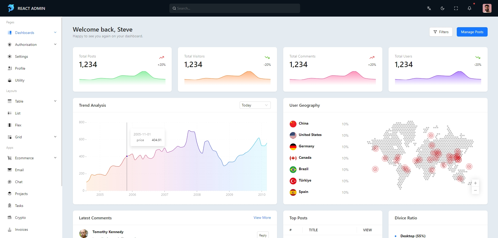

<div align="center">

<h1 >
    <span></span><br>
    <span>React ADMIN</span>
</h1>

基于React开箱即用的企业级中后台框架



</div>


## ✨ 特性

- 丰富业务组件，除了基础的UI组件外，还提供常用的业务组件示例
- 海量页面模板，提供多种场景页面，如：页面、布局、应用等
- 高度可自定义，减少组件间耦合度，允许开发者自定义或重新封装组件
- 积极的技术栈，积极跟进主流技术栈，依赖快速更新，高效完成业务功能

## 🥳 文档

coming soon

## 🍭 使用

```bash
$ git clone https://github.com/shulkme/react-admin.git
$ cd react-admin
$ pnpm install
$ pnpm dev
```

## 🌈 依赖

> \[!TIP]
>
> 框架包含必要依赖和可选依赖，根据需要，自行删减依赖


### 必要

| Name             | Version | Document                                                    |
|------------------|---------|-------------------------------------------------------------|
| react            | 18.2.0  | [React](https://react.dev/)                                 |
| vite             | 5.2.0   | [Vite](https://cn.vitejs.dev/)                              |
| typescript       | 5.2.2   | [TypeScript](https://www.typescriptlang.org/zh/)            |
| react-router-dom | 6.23.1  | [React Router](https://reactrouter.com/en/main)             |
| antd             | 5.17.4  | [Ant Design](https://ant-design.antgroup.com/index-cn)      |
| axios            | 1.7.2   | [Axios](https://axios-http.com/zh/)                         |
| react-redux      | 9.1.2   | [React Redux](https://cn.redux.js.org/)                     |
| antd-style       | 3.6.2   | [Antd Style](https://ant-design.github.io/antd-style/zh-CN) |
| ahooks           | 3.8.0   | [AHooks](https://ahooks.js.org/zh-CN/)                      |
| lodash           | 4.17.21 | [Lodash](https://www.lodashjs.com/)                         |


### 可选

| Name               | Version | Document                                                             | Use        |
|--------------------|---------|----------------------------------------------------------------------|------------|
| axios-mock-adapter | 1.22.0  | [Axios Mock Adapter](https://github.com/ctimmerm/axios-mock-adapter) | 用于本地模拟接口请求 |
| lucide-react       | 0.379.0 | [Lucide](https://lucide.dev/)                                        | 主要图标库      |


## ❤️ 赞助

暂无

## 👻 许可

Whale Admin 遵循 [MIT协议](LICENSE) 。
